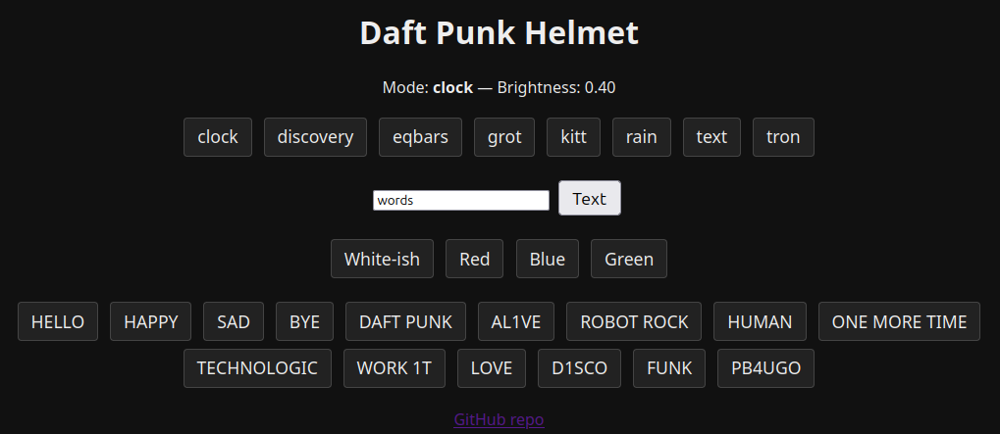
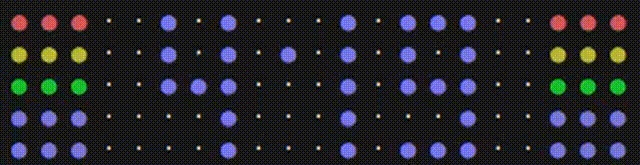
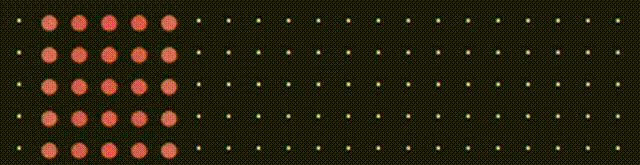
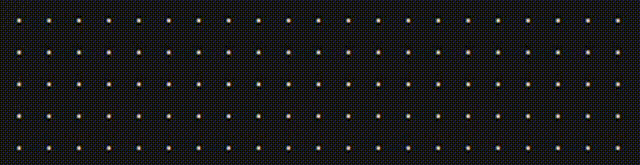
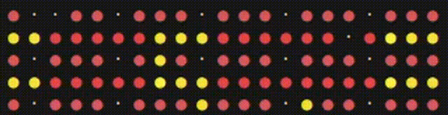

# Daft Punk Helmet Lights

## It's alive


## Onboard Webserver UI


## First light


## Debugging output
```text
· · · · · ● ● · · · ● · · ● ● ● · ● ● ● · · ● ● · · ● · ● · ● ● · · ● · ● · · ·
· · · · · ● · ● · ● · ● · ● · · · · ● · · · ● · ● · ● · ● · ● · ● · ● · ● · · ·
· · · · · ● · ● · ● ● ● · ● ● · · · ● · · · ● ● · · ● · ● · ● · ● · ● ● · · · ·
· · · · · ● · ● · ● · ● · ● · · · · ● · · · ● · · · ● · ● · ● · ● · ● · ● · · ·
· · · · · ● ● · · ● · ● · ● · · · · ● · · · ● · · · ● ● ● · ● · ● · ● · ● · · ·
```

# PI
[Pi Pico 2 W microcontroller Documentation](https://www.raspberrypi.com/documentation/microcontrollers/pico-series.html#pico2w-technical-specification)
* Pin outs
* Diagrams

# BOM
* [Helmet purchased from MazPowerProps](https://www.etsy.com/shop/MazPowerProps?ref=yr_purchases)
* [Raspberry PI Pico](https://www.raspberrypi.com/products/raspberry-pi-pico/)
* [Neo Pixels](https://www.adafruit.com/product/2541?gad_source=1&gad_campaignid=21079227318&gclid=CjwKCAiAlfvIBhA6EiwAcErpybIXyZYECiYq-Q7L3u5l67m0Edsdn_NDSeSnuiATtLG76Yl7Dwm_1xoC0fAQAvD_BwE)

# Modes
## Clock

## Kitt

## Infinity

## WOPR


# Inspo / Notes

[Reddit post with evolution of Thomas Helmet](https://www.reddit.com/r/DaftPunk/comments/m9nyvf/the_evolution_of_thomas_bangalters_helmet/)

http://www.gperco.com/2013/11/daft-punk-helmets-controllers-and-code.html

[Looks like some light patterns](https://github.com/bgreer/sketchbook/tree/master/helmets)